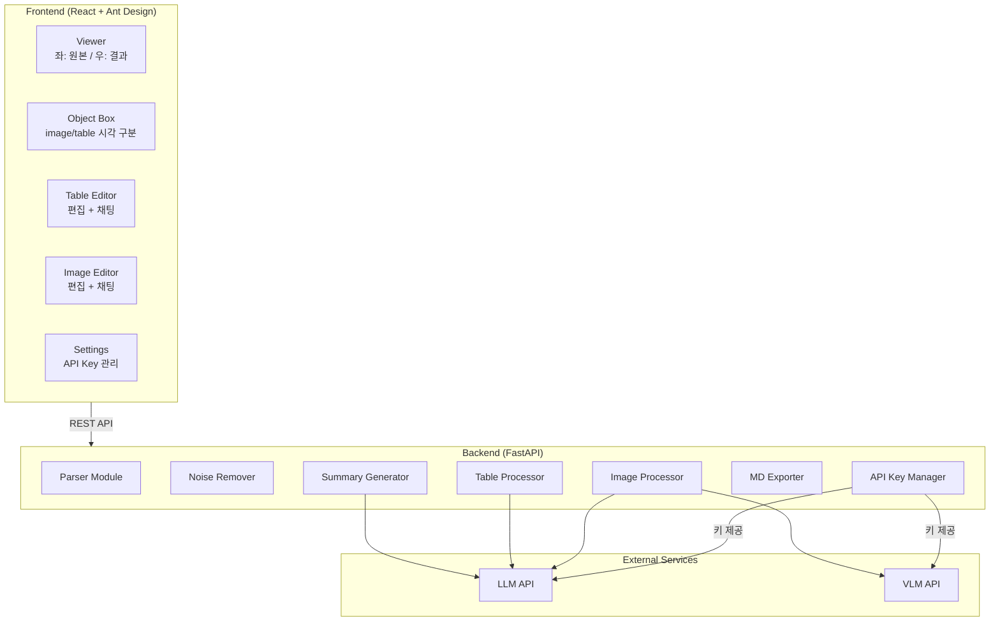
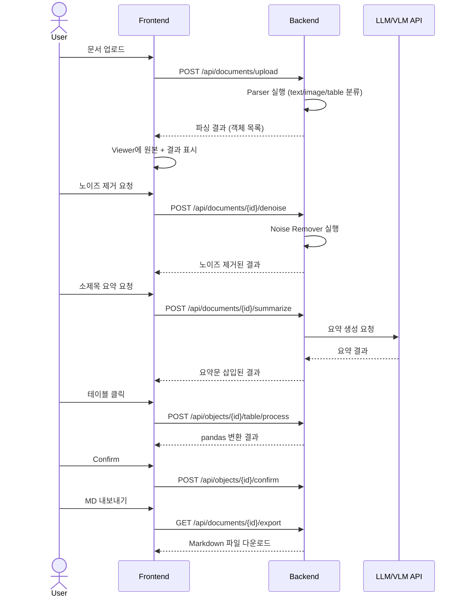

# Design Document: 문서 전처리 도구 (Doc Preprocessing Tool)

## Overview

본 시스템은 RAG 파이프라인의 전처리 단계를 담당하는 웹 애플리케이션이다. PDF, Word, Web Page 문서를 업로드하면 text, image, table 객체로 자동 분류하고, 노이즈 제거 → 소제목 요약문 생성 → 테이블/이미지 후처리 → Markdown 내보내기의 워크플로우를 거쳐 RAG 시스템에 투입 가능한 구조화된 Markdown을 출력한다.

기술 스택:
- Backend: Python (uv 패키지 매니저), FastAPI
- Frontend: React + Ant Design (antd)
- 문서 파싱: PyMuPDF (PDF), python-docx (Word), BeautifulSoup4 (Web Page)
- 테이블 처리: pandas
- 외부 API: LLM (요약, 테이블 flattening), VLM (이미지 해석)
- 데이터 교환: JSON

## Architecture

시스템은 프론트엔드(React SPA)와 백엔드(FastAPI) 2-tier 구조로 구성된다.



### 요청 흐름



## Components and Interfaces

### Backend Modules

#### 1. Parser Module
- 책임: 문서 파일을 받아 text, image, table 객체 목록으로 변환
- 지원 형식: PDF (PyMuPDF), Word (python-docx), Web Page (BeautifulSoup4 + requests)
- 출력: `List[DocumentObject]` — 각 객체는 type, content, order, metadata를 포함

```python
class Parser:
    def parse(self, file: UploadFile) -> ParseResult:
        """문서를 파싱하여 객체 목록 반환"""
        ...

    def parse_url(self, url: str) -> ParseResult:
        """웹 페이지를 파싱하여 객체 목록 반환"""
        ...

    def _detect_format(self, file: UploadFile) -> DocumentFormat:
        """파일 형식 감지 (pdf, docx, unsupported)"""
        ...
```

#### 2. Noise Remover
- 책임: 헤더, 푸터, 페이지 번호 등 노이즈 텍스트 제거
- 기본 패턴: 페이지 번호 (`^\d+$`, `^- \d+ -$`), 반복 헤더/푸터 감지
- 커스텀 패턴: 사용자 정의 정규식 패턴 지원

```python
class NoiseRemover:
    def remove_noise(
        self,
        objects: List[DocumentObject],
        custom_patterns: Optional[NoisePatterns] = None
    ) -> List[DocumentObject]:
        """기본 + 커스텀 패턴으로 노이즈 제거"""
        ...
```

#### 3. Summary Generator
- 책임: 소제목 식별 및 LLM 기반 요약문 생성
- 소제목 식별: 폰트 크기, 볼드, heading 태그 등 휴리스틱 기반
- LLM 호출: API Key Manager에서 키를 가져와 외부 LLM API 호출

```python
class SummaryGenerator:
    def identify_headings(self, objects: List[DocumentObject]) -> List[int]:
        """소제목 객체의 인덱스 목록 반환"""
        ...

    def generate_summaries(
        self,
        objects: List[DocumentObject],
        heading_indices: List[int]
    ) -> List[DocumentObject]:
        """각 소제목 하위 내용에 대한 요약문 생성 후 삽입"""
        ...
```

#### 4. Table Processor
- 책임: 테이블 객체를 pandas DataFrame 변환 또는 LLM text flattening
- 워크플로우: 클릭 → pandas 변환 표시 → (선택) LLM flattening → 편집 → 채팅 수정 → Confirm

```python
class TableProcessor:
    def to_dataframe(self, table_object: DocumentObject) -> str:
        """테이블을 pandas DataFrame으로 변환 후 문자열 반환"""
        ...

    def flatten_with_llm(self, table_object: DocumentObject) -> str:
        """LLM을 통해 테이블을 텍스트로 변환"""
        ...

    def chat_edit(self, current_text: str, user_request: str) -> str:
        """채팅 기반 LLM 수정"""
        ...
```

#### 5. Image Processor
- 책임: 이미지 객체를 텍스트 링크 연결 또는 VLM 해석
- 옵션 A: 이미지를 별도 폴더에 저장 + 지정 텍스트에 `<경로>` 삽입
- 옵션 B: VLM으로 이미지 해석 → 편집 → 채팅 수정 → Confirm

```python
class ImageProcessor:
    def save_and_link(
        self, image_object: DocumentObject, target_text: str, save_dir: str
    ) -> DocumentObject:
        """이미지 저장 후 텍스트에 링크 삽입"""
        ...

    def interpret_with_vlm(self, image_object: DocumentObject) -> str:
        """VLM을 통해 이미지를 텍스트로 해석"""
        ...

    def chat_edit(self, current_text: str, user_request: str) -> str:
        """채팅 기반 VLM/LLM 수정"""
        ...
```

#### 6. MD Exporter
- 책임: 전처리 결과를 Markdown 파일로 직렬화 / Markdown 파일에서 역직렬화
- 라운드트립 보장: export → import 시 동일한 객체 구조 복원
- 객체 타입별 렌더링: text → 본문, summary → 인용문(`>`), table → GFM 테이블, image → `` 또는 VLM 해석 텍스트
- 메타데이터 보존: 각 객체의 id/type/order/confirm_status를 HTML 주석(`<!-- ... -->`)으로 삽입하여 역직렬화 지원

```python
class MDExporter:
    def export(self, document: ProcessedDocument) -> str:
        """전처리 결과를 Markdown 문자열로 직렬화"""
        ...

    def load(self, md_str: str) -> ProcessedDocument:
        """Markdown 문자열에서 전처리 결과 복원"""
        ...

    def validate_all_confirmed(self, document: ProcessedDocument) -> List[str]:
        """미확인 객체 목록 반환 (빈 리스트면 모두 확인됨)"""
        ...
```

#### 7. API Key Manager
- 책임: LLM/VLM API 키의 저장, 로드, 유효성 검증
- 저장: 로컬 파일 시스템에 암호화 저장 (환경 변수 또는 dotenv)

```python
class APIKeyManager:
    def save_key(self, service: str, api_key: str) -> None:
        """API 키를 로컬에 안전하게 저장"""
        ...

    def get_key(self, service: str) -> Optional[str]:
        """저장된 API 키 반환 (없으면 None)"""
        ...

    def validate_key(self, service: str) -> bool:
        """API 키 유효성 검증"""
        ...
```

### Frontend Components

#### Viewer (메인 레이아웃)
- Ant Design `Layout`, `Splitter` 사용
- 좌측: 원본 문서 렌더링 (PDF.js 또는 iframe)
- 우측: 전처리 결과 렌더링 (객체 목록 + Object Box)

#### Object Box
- image/table 객체를 시각적으로 구분하는 카드 컴포넌트
- Confirmed_Status 배지 표시
- 클릭 시 해당 Processor 패널 열기

#### Table/Image Editor Panel
- 결과값 표시 영역 (읽기 전용 / 편집 모드 전환)
- 채팅 입력창 (Ant Design `Input.TextArea`)
- Confirm 버튼

#### Settings Panel
- API 키 입력 폼 (LLM, VLM 각각)
- 저장/검증 버튼

### REST API Endpoints

| Method | Endpoint | 설명 |
|--------|----------|------|
| POST | `/api/documents/upload` | 문서 업로드 및 파싱 |
| POST | `/api/documents/parse-url` | URL 기반 웹 페이지 파싱 |
| POST | `/api/documents/{id}/denoise` | 노이즈 제거 |
| POST | `/api/documents/{id}/summarize` | 소제목 요약문 생성 |
| POST | `/api/documents/{id}/objects/manual` | 수동 객체 지정 |
| POST | `/api/objects/{id}/table/process` | 테이블 pandas 변환 |
| POST | `/api/objects/{id}/table/flatten` | 테이블 LLM flattening |
| POST | `/api/objects/{id}/table/chat` | 테이블 채팅 수정 |
| POST | `/api/objects/{id}/image/link` | 이미지 링크 연결 |
| POST | `/api/objects/{id}/image/interpret` | 이미지 VLM 해석 |
| POST | `/api/objects/{id}/image/chat` | 이미지 채팅 수정 |
| POST | `/api/objects/{id}/confirm` | 객체 Confirm |
| GET | `/api/documents/{id}/export` | Markdown 내보내기 |
| POST | `/api/documents/import` | Markdown 로드 |
| GET | `/api/settings/keys` | API 키 목록 조회 |
| POST | `/api/settings/keys` | API 키 저장 |
| POST | `/api/settings/keys/validate` | API 키 유효성 검증 |


## Data Models

### Core Models

```python
from enum import Enum
from typing import Optional, List
from pydantic import BaseModel


class ObjectType(str, Enum):
    TEXT = "text"
    TABLE = "table"
    IMAGE = "image"
    SUMMARY = "summary"  # 소제목 요약문


class ConfirmStatus(str, Enum):
    PENDING = "pending"
    CONFIRMED = "confirmed"


class DocumentFormat(str, Enum):
    PDF = "pdf"
    DOCX = "docx"
    WEB = "web"


class DocumentObject(BaseModel):
    """파싱된 개별 객체"""
    id: str
    type: ObjectType
    content: str  # 텍스트 내용 또는 이미지 base64
    order: int  # 문서 내 순서
    page: Optional[int] = None  # 페이지 번호 (PDF/Word)
    metadata: dict = {}  # 추가 메타데이터 (폰트 크기, 볼드 등)
    is_heading: bool = False  # 소제목 여부
    confirm_status: ConfirmStatus = ConfirmStatus.PENDING
    image_path: Optional[str] = None  # 이미지 저장 경로
    processed_content: Optional[str] = None  # 후처리된 내용


class NoisePatterns(BaseModel):
    """노이즈 제거 패턴"""
    header_patterns: List[str] = []  # 헤더 정규식 패턴
    footer_patterns: List[str] = []  # 푸터 정규식 패턴
    page_number_patterns: List[str] = []  # 페이지 번호 정규식 패턴


class ParseResult(BaseModel):
    """파싱 결과"""
    document_id: str
    format: DocumentFormat
    objects: List[DocumentObject]
    raw_content: Optional[str] = None  # 원본 텍스트 (Viewer 좌측용)


class ProcessedDocument(BaseModel):
    """전처리 완료 문서 (JSON 내보내기 대상)"""
    document_id: str
    source_filename: str
    format: DocumentFormat
    objects: List[DocumentObject]
    noise_patterns_applied: Optional[NoisePatterns] = None
    created_at: str
    updated_at: str
```

### Markdown Export Schema

내보내기 결과는 `.md` 파일로 출력되며, 각 객체는 순서대로 렌더링된다. 역직렬화를 위한 메타데이터는 HTML 주석으로 삽입된다.

```markdown
<!-- doc:uuid source:example.pdf format:pdf created_at:2025-01-01T00:00:00Z updated_at:2025-01-01T00:00:00Z -->

<!-- obj:obj-001 type:text order:0 page:1 confirm:confirmed -->
본문 텍스트...

<!-- obj:obj-002 type:table order:1 page:1 confirm:confirmed -->
| col1 | col2 |
|------|------|
| a    | b    |

<!-- obj:obj-003 type:image order:2 page:2 confirm:confirmed image_path:/images/obj-003.png -->


<!-- obj:obj-004 type:image order:3 page:3 confirm:confirmed -->
이미지 해석 텍스트...

<!-- obj:obj-005 type:summary order:4 page:2 confirm:confirmed -->
> **요약**: 소제목 하위 내용에 대한 요약문...
```

- **text 객체**: 본문 그대로 출력
- **heading 객체**: `##` 또는 `###` 마크다운 헤딩으로 출력
- **summary 객체**: `>` 인용문 블록으로 출력
- **table 객체**: GFM(GitHub Flavored Markdown) 테이블 문법으로 출력
- **image 객체 (링크 연결)**: `` 형식으로 출력
- **image 객체 (VLM 해석)**: 해석 텍스트를 본문으로 출력


## Correctness Properties

*A property is a characteristic or behavior that should hold true across all valid executions of a system — essentially, a formal statement about what the system should do. Properties serve as the bridge between human-readable specifications and machine-verifiable correctness guarantees.*

### Property 1: Parser output type validity

*For any* supported document (PDF, Word, Web Page), the Parser should return a non-empty list of `DocumentObject` where each object's `type` is one of `text`, `image`, or `table`, and each object has a valid `order` value that preserves document sequence.

**Validates: Requirements 1.1, 1.2, 1.3**

### Property 2: Object Box rendering for non-text objects

*For any* list of `DocumentObject`, the Viewer should render every object with `type` equal to `image` or `table` inside an `Object_Box` component, and every object with `type` equal to `text` should not be wrapped in an `Object_Box`.

**Validates: Requirements 1.4**

### Property 3: Default noise removal

*For any* document containing known noise patterns (page numbers matching `^\d+$` or `^- \d+ -$`, repeated header/footer text), the `NoiseRemover` should produce an output where none of the removed noise text appears, and all non-noise content is preserved.

**Validates: Requirements 3.1**

### Property 4: Custom pattern noise removal

*For any* text content and any valid regex pattern provided as a custom header, footer, or page number pattern, the `NoiseRemover` should remove all text matching that pattern and preserve all non-matching text.

**Validates: Requirements 3.4, 3.5, 3.6**

### Property 5: Heading identification

*For any* parsed document containing elements with heading indicators (larger font size, bold formatting, HTML heading tags), the Parser should identify those elements by setting `is_heading = True`, and non-heading elements should have `is_heading = False`.

**Validates: Requirements 4.1**

### Property 6: Summary insertion structure

*For any* document with identified headings, after summary generation, each heading object should be immediately followed by a `DocumentObject` with `type = summary` containing a non-empty `content` string, and the total object count should increase by the number of headings summarized.

**Validates: Requirements 4.2, 4.4**

### Property 7: Manual heading designation

*For any* text `DocumentObject` with `is_heading = False`, manually designating it as a heading should set `is_heading = True` on that object, and the object's other fields (`content`, `order`, `type`) should remain unchanged.

**Validates: Requirements 4.3**

### Property 8: Manual object designation

*For any* selected document region and target object type (table or image), manual designation should add a new `DocumentObject` to the object list with the specified type, and the total object count should increase by one.

**Validates: Requirements 5.2, 5.3**

### Property 9: Table pandas conversion produces output

*For any* `DocumentObject` with `type = table` containing valid table data, the `TableProcessor.to_dataframe()` method should return a non-empty string representation of the table.

**Validates: Requirements 6.1**

### Property 10: Object confirmation state transition

*For any* `DocumentObject` with `type` equal to `table` or `image`, confirming the object should set `confirm_status` to `CONFIRMED` and store the current result in `processed_content`. The confirmation should be idempotent — confirming an already confirmed object should not change its state.

**Validates: Requirements 6.6, 7.7**

### Property 11: Image link and save

*For any* image `DocumentObject` and any target text string, the `save_and_link` operation should set `image_path` to a non-empty valid file path, and the target text should contain the image path in `<경로>` format.

**Validates: Requirements 7.2**

### Property 12: Markdown export completeness

*For any* `ProcessedDocument`, the exported Markdown should contain exactly the same number of objects as the document, and each object in the Markdown should include metadata comments with `type`, `order`, `confirm_status`, `image_path` (for images), and rendered `content` or `processed_content`.

**Validates: Requirements 9.1, 9.2, 9.3, 9.4**

### Property 13: Unconfirmed object export warning

*For any* `ProcessedDocument` containing at least one `table` or `image` object with `confirm_status = PENDING`, the `validate_all_confirmed` method should return a non-empty list of unconfirmed object IDs.

**Validates: Requirements 9.5**

### Property 14: Markdown serialization round-trip

*For any* valid `ProcessedDocument`, exporting to Markdown and then loading from that Markdown should produce a `ProcessedDocument` that is structurally and content-wise equivalent to the original.

**Validates: Requirements 10.1, 10.2**

### Property 15: API key storage round-trip

*For any* service name and API key string, saving the key via `APIKeyManager.save_key()` and then retrieving it via `APIKeyManager.get_key()` should return the exact same key string.

**Validates: Requirements 8.2, 8.3**


## Error Handling

### 파일 업로드 오류
- 지원하지 않는 파일 형식: `"지원하지 않는 파일 형식입니다"` 메시지 표시, 이전 상태 유지
- 파싱 실패 (손상된 파일, 빈 파일): 오류 내용을 사용자에게 표시, 이전 상태 유지
- 파일 크기 초과: 업로드 전 클라이언트 측 검증, 서버 측 제한 설정

### API 키 오류
- API 키 미등록: LLM/VLM 기능 호출 시 `"LLM API 키를 먼저 등록해주세요"` 또는 `"VLM API 키를 먼저 등록해주세요"` 안내 메시지 표시
- API 키 유효하지 않음: `"API 키가 유효하지 않습니다. 설정에서 확인해주세요"` 오류 메시지 표시
- API 호출 실패 (네트워크, 타임아웃, 429 Rate Limit): 재시도 로직 (최대 3회) + 사용자에게 오류 메시지 표시

### Markdown 오류
- 올바르지 않은 Markdown 형식: `"올바르지 않은 Markdown 형식입니다"` 오류 메시지 표시
- 미확인 객체 존재 시 내보내기: `"확인되지 않은 객체가 있습니다. 모든 객체를 확인한 후 내보내기를 진행해주세요"` 경고 메시지 표시

### 노이즈 제거 오류
- 잘못된 정규식 패턴: `"올바르지 않은 패턴입니다"` 오류 메시지 표시, 패턴 적용 건너뜀

### 일반 오류 처리 전략
- 모든 API 엔드포인트는 표준 오류 응답 형식 사용: `{"error": {"code": str, "message": str}}`
- 프론트엔드는 Ant Design `message` 또는 `notification` 컴포넌트로 오류 표시
- 오류 발생 시 현재 작업 상태를 보존하여 데이터 손실 방지

## Testing Strategy

### 테스트 프레임워크
- Unit/Integration: **pytest** (Python backend)
- Property-Based Testing: **Hypothesis** (Python)
- Frontend: **Jest** + **React Testing Library**
- E2E: **Playwright** (선택적)

### Unit Tests
- 각 모듈(Parser, NoiseRemover, SummaryGenerator, TableProcessor, ImageProcessor, JSONExporter, APIKeyManager)에 대한 개별 단위 테스트
- 특정 예시 입력에 대한 기대 출력 검증
- 에지 케이스 집중:
  - 빈 문서, 손상된 파일, 지원하지 않는 형식
  - 빈 API 키, 유효하지 않은 API 키
  - 올바르지 않은 JSON, 빈 JSON
  - 잘못된 정규식 패턴
  - 미확인 객체가 있는 상태에서 내보내기

### Property-Based Tests (Hypothesis)
- 최소 100회 반복 실행 (`@settings(max_examples=100)`)
- 각 테스트는 설계 문서의 Property를 참조하는 태그 포함
- 태그 형식: `# Feature: doc-preprocessing-tool, Property {number}: {title}`

| Property | 테스트 설명 | 생성 전략 |
|----------|------------|----------|
| Property 1 | Parser 출력 타입 유효성 | 다양한 형식의 문서 구조 생성 |
| Property 2 | Object Box 렌더링 | 랜덤 객체 목록 생성 |
| Property 3 | 기본 노이즈 제거 | 노이즈가 삽입된 텍스트 생성 |
| Property 4 | 커스텀 패턴 노이즈 제거 | 랜덤 텍스트 + 랜덤 패턴 생성 |
| Property 5 | 소제목 식별 | heading 속성이 포함된 문서 구조 생성 |
| Property 6 | 요약문 삽입 구조 | heading이 포함된 객체 목록 생성 |
| Property 7 | 수동 소제목 지정 | 랜덤 text 객체 생성 |
| Property 8 | 수동 객체 지정 | 랜덤 영역 + 객체 타입 생성 |
| Property 9 | 테이블 pandas 변환 | 랜덤 테이블 데이터 생성 |
| Property 10 | 객체 확인 상태 전환 | 랜덤 table/image 객체 생성 |
| Property 11 | 이미지 링크 저장 | 랜덤 이미지 객체 + 텍스트 생성 |
| Property 12 | Markdown 내보내기 완전성 | 랜덤 ProcessedDocument 생성 |
| Property 13 | 미확인 객체 경고 | 혼합 confirm_status 객체 생성 |
| Property 14 | Markdown 직렬화 라운드트립 | 랜덤 ProcessedDocument 생성 |
| Property 15 | API 키 저장 라운드트립 | 랜덤 서비스명 + API 키 문자열 생성 |

### 테스트 실행
```bash
# uv 환경에서 테스트 실행
uv run pytest tests/ -v
# Property-based tests만 실행
uv run pytest tests/ -v -k "property"
# Frontend 테스트
npm test -- --run
```
