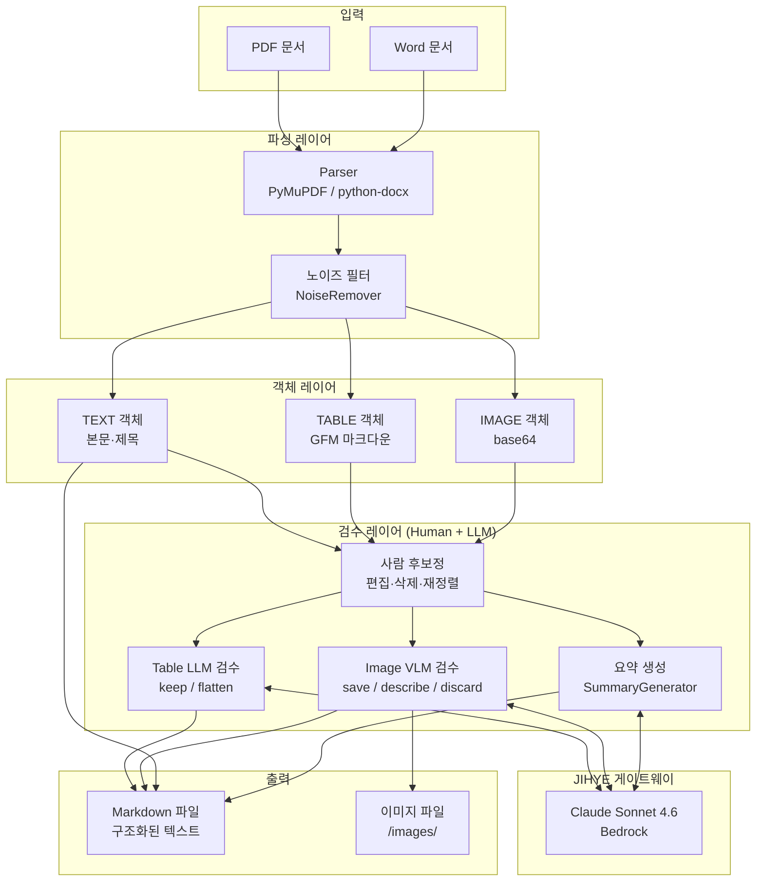
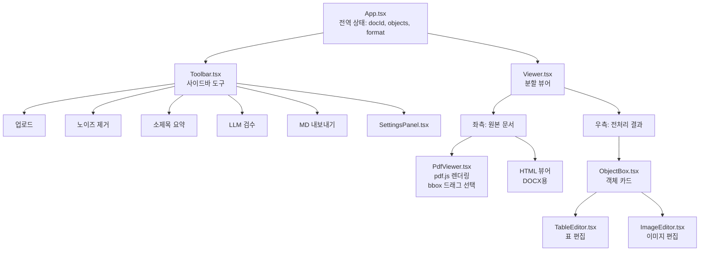
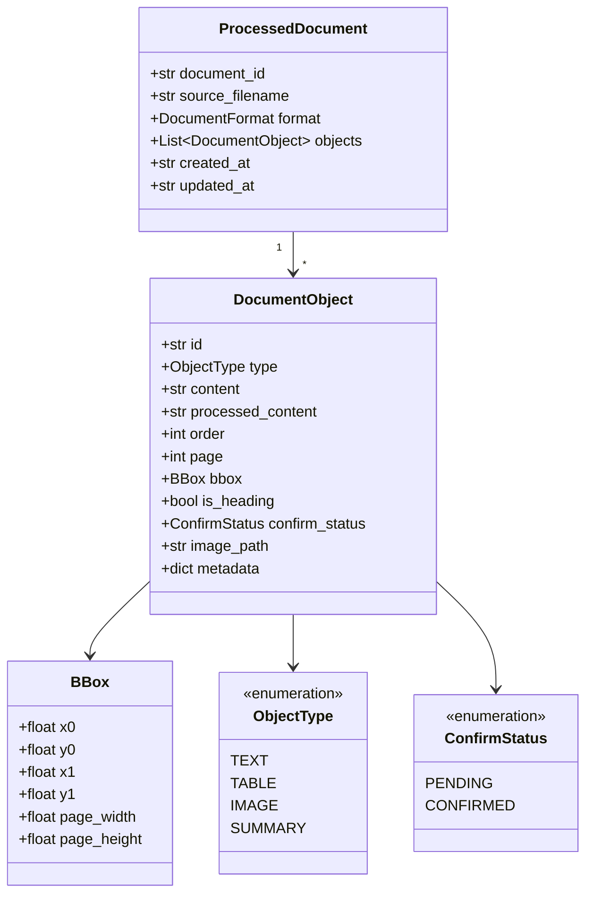
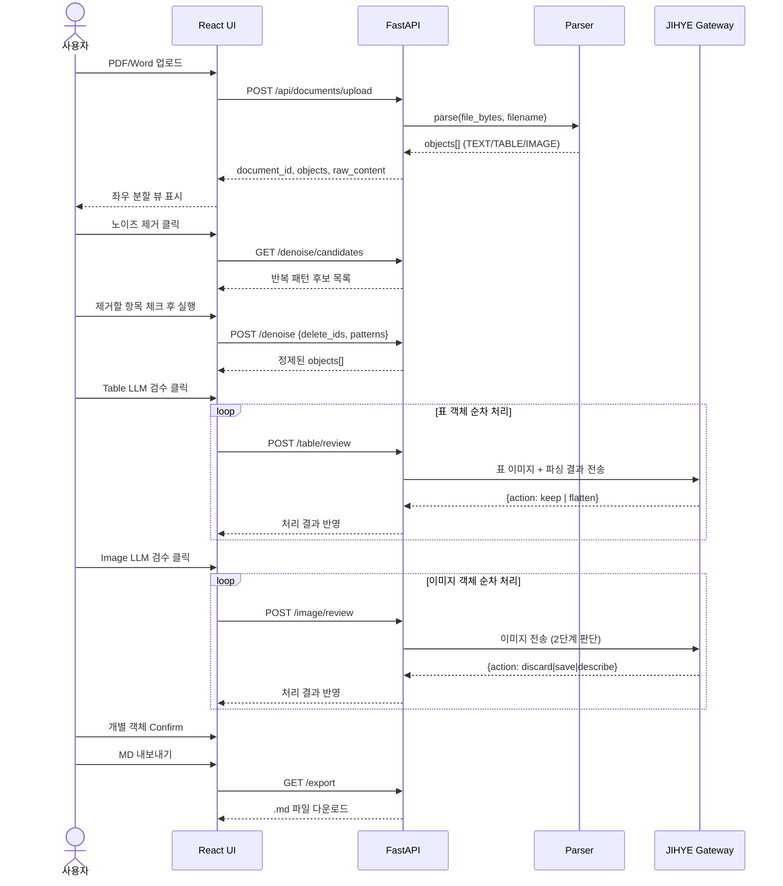
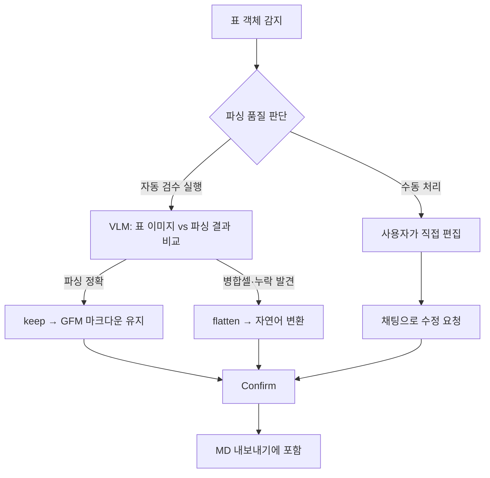
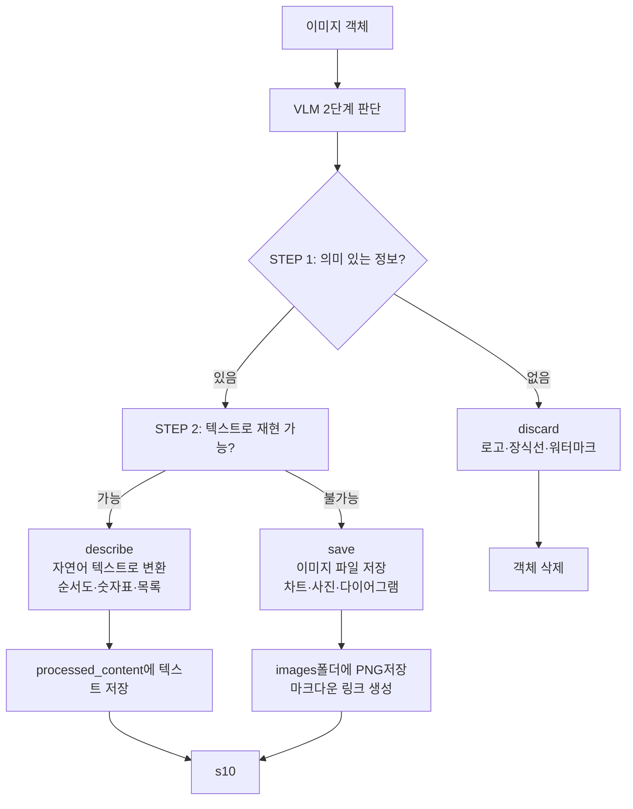
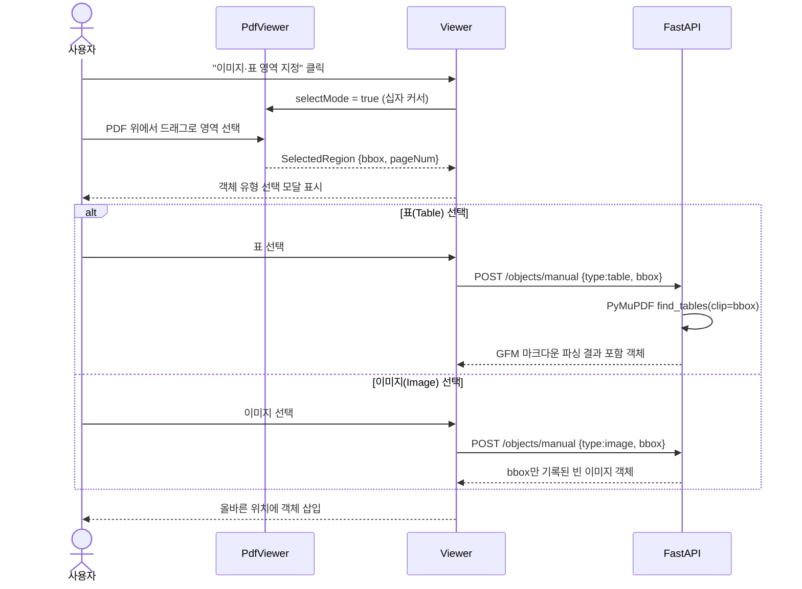

# RAG 문서 전처리 도구 보고자료

---

## 1. 개요

기업 내 비정형 문서(PDF, Word)를 RAG(Retrieval-Augmented Generation) 파이프라인에 활용하기 위해서는 단순한 텍스트 추출만으로는 부족합니다. 표, 이미지, 노이즈, 구조적 계층이 혼재된 문서를 그대로 청크화하면 검색 품질이 크게 저하됩니다.

본 도구는 **파싱 정확도를 높이고 사람이 직접 후보정할 수 있는 워크플로우**를 제공하여, 기업 RAG 시스템의 기반이 되는 고품질 문서 전처리를 실현합니다.

| 항목 | 내용 |
|------|------|
| 목적 | 기업 문서의 RAG 파이프라인 전처리 품질 향상 |
| 대상 문서 | PDF, Word(DOCX) |
| 핵심 방식 | 자동 파싱 + 사람 후보정 + LLM/VLM 보조 검수 |
| LLM 연동 | 사내 JIHYE 게이트웨이 (Claude Sonnet 4.6, Bedrock) |
| 기술 스택 | FastAPI, React, PyMuPDF, python-docx, Ant Design |

---

## 2. 앱이 다루는 내용

### 2.1 문서 유형

| 유형 | 파싱 방식 |
|------|----------|
| PDF | PyMuPDF — 페이지별 텍스트 블록·표·이미지 추출, BBox 좌표 기록 |
| Word(DOCX) | python-docx — 단락 스타일·표·인라인 이미지 추출, HTML 렌더링 |

### 2.2 추출 객체 유형

| 객체 타입 | 설명 |
|-----------|------|
| **TEXT** | 본문 단락, 제목(h1~h6 레벨 자동 감지) |
| **TABLE** | GFM 마크다운 표, LLM으로 자연어 변환 가능 |
| **IMAGE** | base64 embedded → 분류 후 저장/설명/폐기 |
| **SUMMARY** | LLM이 생성한 섹션 요약 객체 |

### 2.3 처리 대상 노이즈

- 반복 헤더·푸터 (회사명, 문서번호 등)
- 페이지 번호 (단독 숫자, `- 3 -` 형식 등)
- 워터마크성 텍스트 (예: `Proprietary & Confidential`)
- 장식용 이미지 (구분선, 로고, 빈 여백)

---

## 3. 이 앱으로 할 수 있는 것

```
✅ PDF / Word 문서 업로드 및 자동 파싱
✅ 텍스트·표·이미지 객체 자동 분류 및 시각화
✅ 원본 문서와 전처리 결과 나란히 비교 (좌우 분할 뷰)
✅ 노이즈 후보 자동 탐지 및 일괄 제거
✅ 표 객체의 품질 자동 검수 (LLM/VLM) → 자연어 변환
✅ 이미지 객체 분류 (저장 / 텍스트 설명 / 폐기)
✅ PDF에서 표·이미지 영역 수동 지정 및 재파싱
✅ 객체 순서 드래그 앤 드롭 재정렬
✅ 객체 선택 삭제 (체크박스 일괄 선택)
✅ 섹션 선택 후 LLM 요약 삽입
✅ 전체 확인(Confirm) 완료 후 Markdown(.md) 내보내기
✅ 저장 경로 지정 내보내기 (로컬 서버 경로)
```

---

## 4. 개발 개요

### 4.1 개발 환경

| 구분 | 기술 |
|------|------|
| 백엔드 | Python 3.14, FastAPI, uvicorn |
| 프론트엔드 | TypeScript, React 18, Vite, Ant Design 5 |
| PDF 파싱 | PyMuPDF (fitz) |
| DOCX 파싱 | python-docx, lxml |
| LLM/VLM | Claude Sonnet 4.6 (JIHYE 게이트웨이, Bedrock 프로토콜) |
| 상태관리 | React useState / useCallback (서버 상태는 FastAPI 메모리) |
| 드래그 정렬 | @dnd-kit/core, @dnd-kit/sortable |
| PDF 렌더링 | pdfjs-dist |

### 4.2 시스템 구성

- **단일 서버 구성**: 백엔드(포트 8000) + 프론트엔드(포트 5173) 로컬 실행
- **인메모리 저장소**: 세션 단위 문서 상태 관리 (DB 미사용)
- **JIHYE 게이트웨이**: 사내 DLP 정책 준수를 위한 Claude API 프록시

---

## 5. 논리 구성도



---

## 6. 시스템 다이어그램

### 6.1 전체 아키텍처

```mermaid
graph LR
    subgraph CLIENT["클라이언트 (브라우저)"]
        UI[React UI<br/>Ant Design]
        PDFJS[pdf.js<br/>PDF 렌더링]
    end

    subgraph SERVER["백엔드 서버 (FastAPI :8000)"]
        DOC_API[Documents API<br/>/api/documents/...]
        OBJ_API[Objects API<br/>/api/objects/...]
        MEMSTORE[(인메모리 저장소<br/>_docs / _raw_files)]

        subgraph MODULES["처리 모듈"]
            PARSER_M[parser.py]
            NOISE_M[noise_remover.py]
            TABLE_M[table_processor.py]
            IMAGE_M[image_processor.py]
            SUMM_M[summary_generator.py]
            EXPORT_M[md_exporter.py]
            LLM_M[llm_client.py]
        end
    end

    subgraph EXTERNAL["외부 시스템"]
        JIHYE[JIHYE 게이트웨이<br/>jihye.ucube.lgudax.cool]
        BEDROCK[Claude Sonnet 4.6<br/>AWS Bedrock]
    end

    subgraph FILESYSTEM["파일 시스템"]
        IMAGES_DIR[/backend/images/<br/>저장된 이미지]
        ENV[.env<br/>JIHYE_TOKEN]
    end

    UI -->|REST API| DOC_API
    UI -->|REST API| OBJ_API
    UI -->|파일 스트림| PDFJS

    DOC_API --> MEMSTORE
    OBJ_API --> MEMSTORE
    DOC_API --> PARSER_M
    DOC_API --> NOISE_M
    DOC_API --> EXPORT_M
    OBJ_API --> TABLE_M
    OBJ_API --> IMAGE_M
    OBJ_API --> SUMM_M

    TABLE_M --> LLM_M
    IMAGE_M --> LLM_M
    SUMM_M --> LLM_M

    LLM_M -->|Bearer JWT| JIHYE
    JIHYE --> BEDROCK

    IMAGE_M --> IMAGES_DIR
    LLM_M --> ENV
```

### 6.2 프론트엔드 컴포넌트 구조



---

## 7. 구성 요소 설명

### 7.1 백엔드 모듈

| 모듈 | 역할 | 핵심 기능 |
|------|------|----------|
| `parser.py` | 문서 파싱 | PDF/DOCX → 구조화된 객체 배열. 2-pass 처리로 제목 레벨·들여쓰기 자동 감지 |
| `noise_remover.py` | 노이즈 제거 | 반복 패턴 탐지, 정규식 기반 헤더·푸터·페이지번호 필터링, 최대 200자 기준 |
| `table_processor.py` | 표 처리 | GFM 마크다운 파싱, LLM 자연어화, VLM 품질 판정(keep/flatten) |
| `image_processor.py` | 이미지 처리 | VLM 2단계 판단 트리(discard/save/describe), bbox 크롭 기반 정확한 이미지 저장 |
| `summary_generator.py` | 요약 생성 | 선택 객체 텍스트 병합 후 LLM 요약, SUMMARY 객체로 삽입 |
| `md_exporter.py` | MD 내보내기 | 확정된 객체를 GFM Markdown으로 변환, 메타데이터 주석 포함 |
| `llm_client.py` | LLM 클라이언트 | JIHYE 게이트웨이 단일 인터페이스, Bedrock 이중 JSON 응답 파싱 |

### 7.2 프론트엔드 컴포넌트

| 컴포넌트 | 역할 |
|----------|------|
| `App.tsx` | 전역 상태(docId, objects, format) 관리 및 레이아웃 |
| `Toolbar.tsx` | 섹션화된 사이드바(문서/전처리/LLM 검수/설정) |
| `Viewer.tsx` | 좌우 분할 뷰, 드래그 정렬, 페이지별 구분선, 체크박스 선택 삭제 |
| `PdfViewer.tsx` | pdf.js 기반 PDF 렌더링, 객체 bbox 오버레이, 드래그 영역 지정 |
| `ObjectBox.tsx` | 타입별 카드(TEXT/TABLE/IMAGE), 편집·삭제·Heading 토글·Confirm |
| `TableEditor.tsx` | 표 Flatten, 채팅 편집, Confirm |
| `ImageEditor.tsx` | 이미지 링크 연결, VLM 해석, 채팅 편집, Confirm |

### 7.3 데이터 모델



---

## 8. 주요 시나리오 흐름

### 8.1 전체 문서 처리 흐름



### 8.2 표 처리 시나리오



### 8.3 이미지 처리 시나리오



### 8.4 수동 영역 지정 시나리오



---

## 9. 주요 설계 결정

### 9.1 파싱 + 사람 후보정의 하이브리드 구조

**결정**: 완전 자동화 대신 자동 파싱 → 사람 검수 → LLM 보조 3단계 구조 채택

**이유**:
- 기업 문서는 형식이 제각각이라 100% 자동화 파싱이 불가능
- 표의 셀 병합, 복잡한 다단 레이아웃은 파서가 오인식하는 경우가 많음
- RAG 품질은 전처리 정확도에 직결되므로 사람의 최종 판단이 필수

**결과**: LLM은 "보조 검수자" 역할로 한정, 최종 확정(Confirm)은 항상 사람이 수행

---

### 9.2 객체 단위 Confirm 강제

**결정**: 표·이미지 객체는 반드시 Confirm 상태여야 내보내기 가능

**이유**:
- 미처리 표(원시 GFM)나 미처리 이미지(base64)가 RAG에 들어가면 검색 품질이 오히려 저하
- 사용자가 실수로 검수 안 한 객체를 포함시키는 사고 방지

---

### 9.3 LLM 호출을 단일 클라이언트로 집중

**결정**: `llm_client.py` 하나에서만 JIHYE 게이트웨이 호출

**이유**:
- 사내 DLP 정책상 `api.anthropic.com` 직접 호출 차단
- 인증 토큰 관리, 응답 파싱(이중 JSON) 로직을 한 곳에서만 유지

---

### 9.4 이미지 저장은 항상 bbox 크롭 기준

**결정**: embedded xref 이미지 대신 PDF bbox 크롭으로 이미지 저장

**이유**:
- PyMuPDF의 block type=1에서 xref 추출 실패 시 페이지 첫 번째 이미지가 모든 블록에 중복 할당되는 버그 발생
- bbox 크롭 방식이 화면에 보이는 이미지와 정확히 일치하는 유일한 방법

---

### 9.5 인메모리 상태 관리

**결정**: 데이터베이스 없이 FastAPI 프로세스 메모리로 세션 관리

**이유**:
- 단일 사용자 로컬 도구 특성상 DB 설정 오버헤드 불필요
- 처리 중 상태가 복잡하고 자주 변경됨 → ORM보다 직접 객체 조작이 빠름

**한계**: 서버 재시작 시 작업 내용 소실 → 향후 JSON 직렬화 저장 기능 추가 가능

---

## 10. 기존 전처리가 없었을 때의 Pain Point

### 10.1 현실에서 겪는 문제

```mermaid
graph TD
    RAW[원본 PDF/Word] -->|단순 텍스트 추출| FLAT[평탄화된 텍스트]

    FLAT --> P1[❌ 표가 깨진 텍스트로 변환<br/>셀 병합 무시, 열 순서 혼재]
    FLAT --> P2[❌ 이미지 완전 누락<br/>차트·다이어그램 정보 소실]
    FLAT --> P3[❌ 헤더·푸터 반복<br/>모든 청크에 회사 CI 포함]
    FLAT --> P4[❌ 페이지 번호 노이즈<br/>"3" "- 4 -" 등이 단독 청크]
    FLAT --> P5[❌ 구조 정보 소실<br/>제목·본문·목록 구분 불가]
    FLAT --> P6[❌ 검색 정확도 저하<br/>관련 없는 청크가 상위 노출]
```

### 10.2 Pain Point 상세

| 문제 | 증상 | RAG 영향 |
|------|------|----------|
| **표 파싱 오류** | 셀 병합이 무시되어 동일 값이 여러 행에 중복 출력 | 수치 데이터 검색 시 오답 생성 |
| **이미지 누락** | 차트·그래프·다이어그램이 통째로 사라짐 | 시각 정보 기반 질문에 답변 불가 |
| **헤더·푸터 오염** | "LG U+ Proprietary & Confidential" 등이 모든 청크에 포함 | 벡터 유사도 계산 왜곡 |
| **구조 소실** | 제목과 본문이 동일 레벨로 처리 | 섹션 기반 검색 불가 |
| **쓰레기 청크** | 페이지 번호("5")만 있는 청크 생성 | 검색 노이즈 증가 |
| **문서 품질 편차** | 처리 결과를 확인할 방법 없음 | 오류가 RAG까지 그대로 전파 |

### 10.3 본 도구로 해결되는 것

| Pain Point | 해결 방법 |
|------------|----------|
| 표 파싱 오류 | VLM이 원본 이미지 대조 검수 → flatten으로 자연어화 |
| 이미지 누락 | VLM 판단으로 describe/save 분기 → 정보 보존 |
| 헤더·푸터 오염 | 반복 패턴 자동 탐지 + 사용자 선택 제거 |
| 구조 소실 | 폰트 크기·볼드·번호 패턴으로 h1~h6 자동 복원 |
| 쓰레기 청크 | 크기·종횡비 필터로 점선·구분선 이미지 자동 제외 |
| 품질 확인 불가 | 원본·결과 나란히 비교 + Confirm 강제 워크플로우 |

---

## 부록. API 엔드포인트 전체 목록

### Documents API

| 메서드 | 엔드포인트 | 기능 |
|--------|-----------|------|
| POST | `/api/documents/upload` | 파일 업로드 및 파싱 |
| GET | `/api/documents/{doc_id}/denoise/candidates` | 노이즈 후보 탐지 |
| POST | `/api/documents/{doc_id}/denoise` | 노이즈 제거 |
| POST | `/api/documents/{doc_id}/summarize-selection` | 선택 영역 요약 |
| POST | `/api/documents/{doc_id}/objects/reorder` | 객체 순서 변경 |
| POST | `/api/documents/{doc_id}/objects/manual` | 수동 객체 추가 |
| GET | `/api/documents/{doc_id}/export` | Markdown 내보내기 |
| GET | `/api/documents/{doc_id}/file` | 원본 파일 반환 |

### Objects API

| 메서드 | 엔드포인트 | 기능 |
|--------|-----------|------|
| POST | `/api/objects/{doc_id}/{obj_id}/table/process` | 표 DataFrame 변환 |
| POST | `/api/objects/{doc_id}/{obj_id}/table/flatten` | 표 자연어 변환 |
| POST | `/api/objects/{doc_id}/{obj_id}/table/review` | 표 품질 검수 |
| POST | `/api/objects/{doc_id}/{obj_id}/table/chat` | 표 채팅 편집 |
| POST | `/api/objects/{doc_id}/{obj_id}/image/link` | 이미지 저장·링크 |
| POST | `/api/objects/{doc_id}/{obj_id}/image/interpret` | 이미지 VLM 해석 |
| POST | `/api/objects/{doc_id}/{obj_id}/image/review` | 이미지 처리 판정 |
| POST | `/api/objects/{doc_id}/{obj_id}/image/chat` | 이미지 설명 편집 |
| POST | `/api/objects/{doc_id}/{obj_id}/confirm` | 객체 확정 |
| PATCH | `/api/objects/{doc_id}/{obj_id}/content` | 내용 수정 |
| POST | `/api/objects/{doc_id}/{obj_id}/heading` | 제목 설정 |
| DELETE | `/api/objects/{doc_id}/{obj_id}` | 객체 삭제 |
